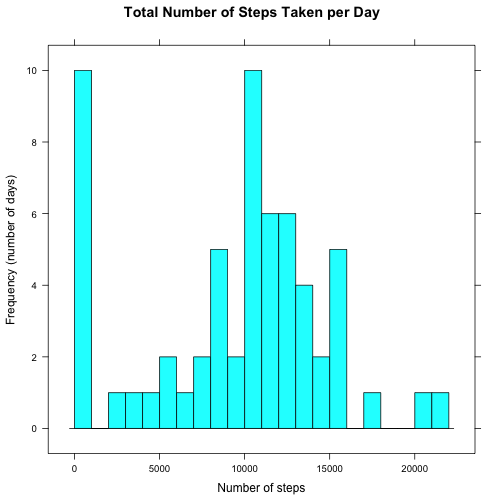
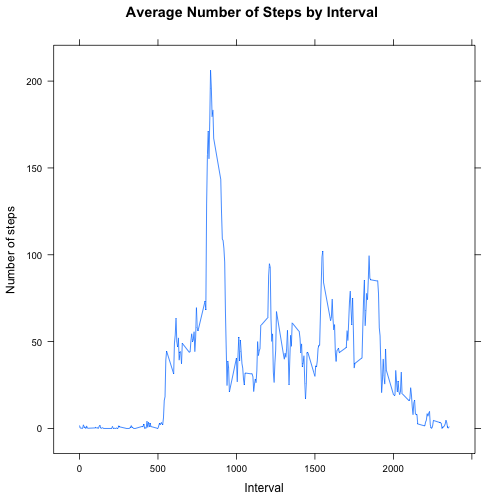
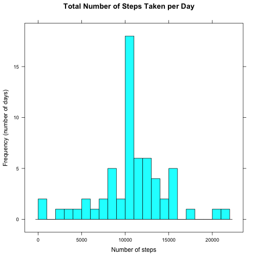
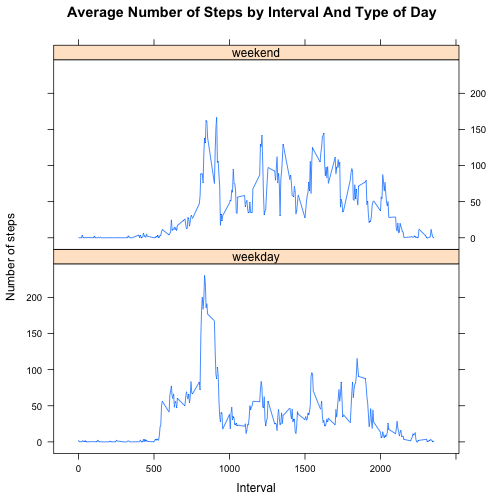

## Loading and preprocessing the data

We use the `dplyr` and `lubridate` packages to simplify data manipulation,
and the `lattice` plotting system.

Unpack the ZIP file provided and read the CSV data with default settings.


```r
library(dplyr,warn.conflicts=FALSE)
library(lubridate)
library(lattice)
dataFile="activity.csv"
if (!file.exists(dataFile))
    unzip("activity.zip")
activity <- tbl_df(read.csv(dataFile))
```


## What is the mean total number of steps taken per day?

### Histogram of total number of steps

Calculate the number of steps taken by day. *NA* values are ignored, which 
results in a total of 0 for ten days.


```r
steps_by_day <- activity %>% 
    group_by(date) %>% 
    summarise(total=sum(steps, na.rm=TRUE))
histogram(~ total, data=steps_by_day, breaks=23, type="count",
          main="Total Number of Steps Taken per Day",
          xlab="Number of steps", ylab="Frequency (number of days)")
```

 

### Mean and median totals

The average and median value of total steps taken by day.


```r
daily_avg <- steps_by_day %>% 
    summarise(mean=mean(total), median=median(total))
daily_avg
```

```
## Source: local data frame [1 x 2]
## 
##      mean median
## 1 9354.23  10395
```


## What is the average daily activity pattern?

### Time series plot of steps by interval

We here calculate the average number of steps taken within each 5 minute
interval, again ignoring *NA* values. The plot indicates minimal night time 
activity. During the day, we find periods of high and moderate activity, with
a visible peak between 8 and 9. 


```r
steps_by_interval <- activity %>%
    group_by(interval) %>%
    summarise(avg=mean(steps, na.rm=TRUE))
xyplot(avg ~ interval, data=steps_by_interval, type="l",
       main="Average Number of Steps by Interval",
       xlab="Interval", ylab="Number of steps")
```

 

### Interval with maximum number of steps 

The five minute interval with the maximum number of steps on average:


```r
steps_by_interval %>% filter(avg == max(avg))
```

```
## Source: local data frame [1 x 2]
## 
##   interval      avg
## 1      835 206.1698
```


## Imputing missing values

### Total number of missing values

Merely the steps column contains missing values. The total of *NA* step counts
is:


```r
activity %>% tally(is.na(steps))
```

```
## Source: local data frame [1 x 1]
## 
##      n
## 1 2304
```

### Filling missing values

We replace missing step counts with the number of steps taken at the
given interval averaged for all days with a known value.


```r
imputed <- activity %>% 
    group_by(interval) %>% 
    mutate(steps=replace(steps, is.na(steps), round(mean(steps, na.rm=TRUE))))
```

### Histogram of total number of steps 

The histogram presented above is reproduced here, however, with the data set
where missing values have been replaced with the interval average.
Note that as a result, there are no longer any days with zero steps taken
and only two days have a value below 1000 steps. Instead, the number of 
days with a number of steps close to the overall average is now almost twice
as high as in the histogram above.


```r
steps_by_day <- imputed %>% 
    group_by(date) %>% 
    summarise(total=sum(steps, na.rm=TRUE))
histogram(~ total, data=steps_by_day, breaks=23, type="count",
          main="Total Number of Steps Taken per Day",
          xlab="Number of steps", ylab="Frequency (number of days)")
```

 

### Mean and median totals

Both the average and median number of steps taken per day have increased.
The average is now above the median, while with missing data (counted as 0)
the average was below the median.


```r
daily_avg <- steps_by_day %>% 
    summarise(mean=mean(total), median=median(total))
daily_avg
```

```
## Source: local data frame [1 x 2]
## 
##       mean median
## 1 10765.64  10762
```


## Are there differences in activity patterns between weekdays and weekends?

We add here a factor variable `day` to the data set w/o missing values that
indicates whether the given day is either on a weekend or not.
The plot of the average number of steps taken in any 5 minute interval is
presented separately for both groups of days.

The plots clearly show a difference between weekdays and weekends. On a
weekend, there is less activity in the morning hours compared to a weekday.
Also, the activity appears to be much more evenly distributed on a weekend.


```r
steps_by_interval_day <- imputed %>%
    mutate(day=as.factor(ifelse(wday(date) %in% 2:6, 
                                "weekday", "weekend"))) %>%
    group_by(day, interval) %>%
    summarize(avg=mean(steps))
xyplot(avg ~ interval | day, data=steps_by_interval_day, 
       layout=c(1,2), type="l",
       main="Average Number of Steps by Interval And Type of Day",
       xlab="Interval", ylab="Number of steps")
```

 
